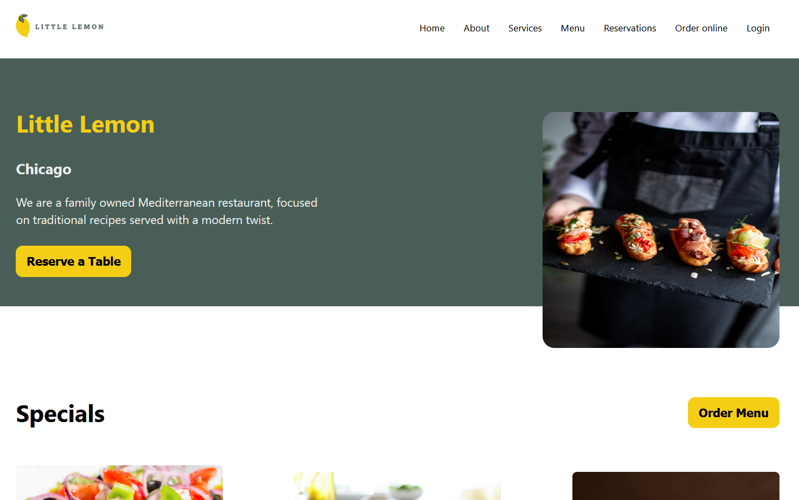
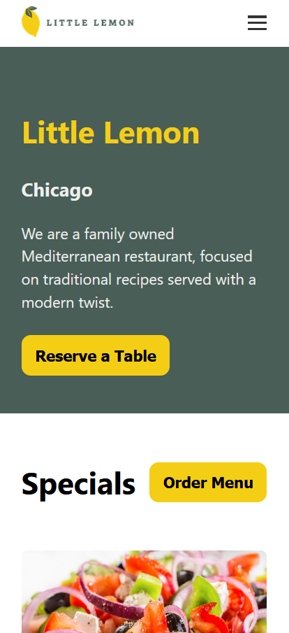

# Meta Front-End Developer Capstone: Little Lemon Table Reservation

  <!-- Desktop screenshot -->
  

  <!-- Mobile screenshot -->
  

---

A simple React project built as part of the **Meta Front-End Developer Professional Certificate**.  
This web app allows users to reserve a table at the Little Lemon restaurant by selecting a date, time, number of guests, and occasion.

🔗 **Live Demo:** [https://little-lemon-tb.netlify.app/](https://little-lemon-tb.netlify.app/)

🖌️ **Figma Design:** [View my design here](https://www.figma.com/design/DaGsafCbaru8mwH7qLLZIZ/Meta-capstone?node-id=0-1&p=f)

💻 **Tech Stack:** Vanilla React (with very minimal external libraries)

The project focuses on implementing clean UI and component-based architecture using core React concepts such as:

- Component composition
- useState and useReducer for state management
- React Router for navigation
- Simple form handling and validation
